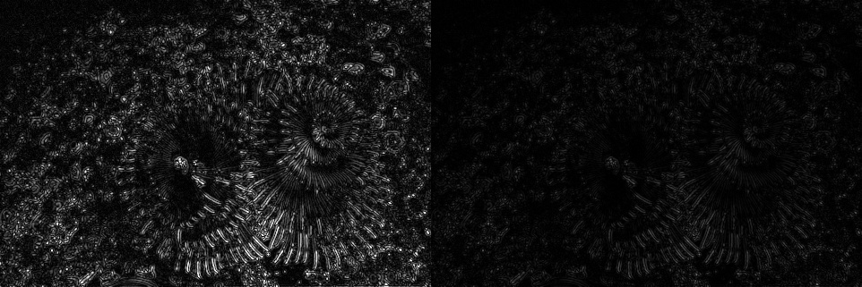
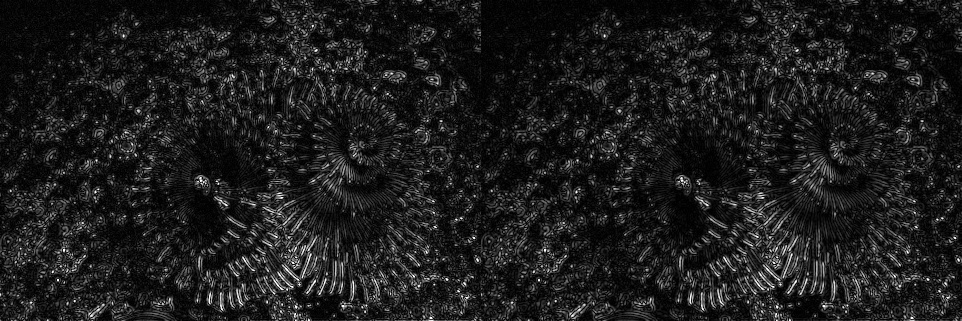
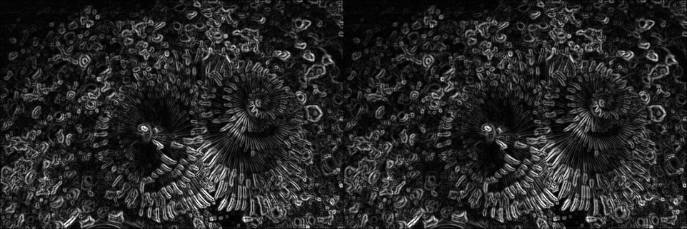
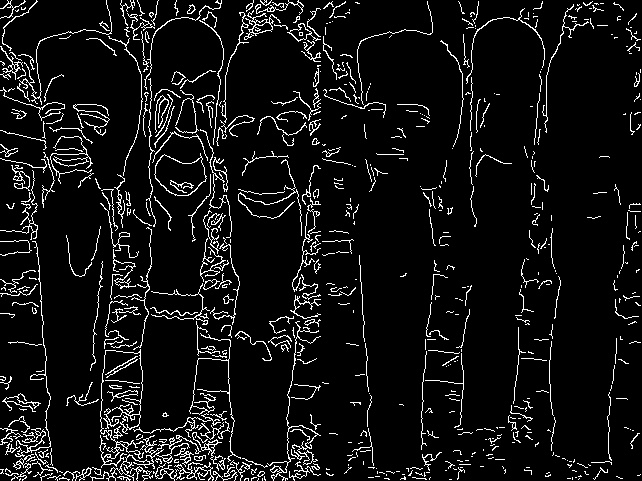
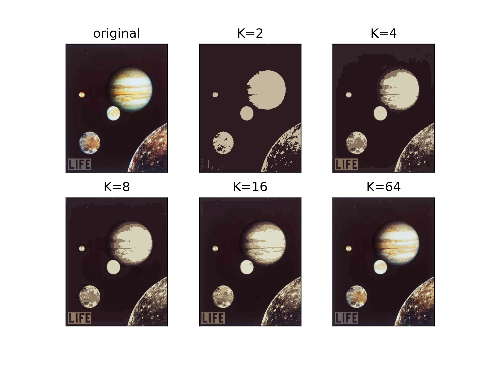
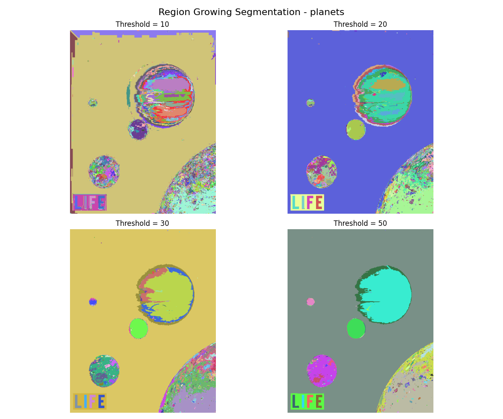

# CV Proj2: Edge Detection & Image Segmentation

## Prerequisite

numpy version of convolution is implemented in ``ops.py``

```python
def numpy_conv2d(image, kernel):
    kh, kw = kernel.shape
    pad_h, pad_w = kh // 2, kw // 2
    
    padded = np.pad(image, ((pad_h, pad_h), (pad_w, pad_w)),
                   mode='reflect')
    
    shape = (image.shape[0], image.shape[1], kh, kw)
    strides = padded.strides + padded.strides
    windows = np.lib.stride_tricks.as_strided(
        padded, shape=shape, strides=strides)
    
    output = np.einsum('ijkl,kl->ij', windows, kernel)
    
    return output.astype(np.float32)
```

feature: high efficiency using parallel numpy ops

Gaussian, Laplacian and sobel kernel is conducted through this numpy version of convolution.

## EdgeDetection

### Laplacian Operator

normal laplacian kernel:
```python
standard_laplacian_3x3 = np.array([[0,  1, 0],
                                   [1, -4, 1],
                                   [0,  1, 0]], dtype=np.float32)
```
but this kernel results to a darker image than cv2 output:


After searching for documents, it is found that the kernel cv2 uses is:

```python
cv2_laplacian_3x3 = np.array([[2, 0, 2],
                           [0, -8, 0],
                           [2, 0, 2]], dtype=np.float32)
```

and it will get:




### Sobel Operator

kernel for x-direction:
```python
sobel_x_kernel = np.array([[-1, 0, 1],
                           [-2, 0, 2],
                           [-1, 0, 1]], dtype=np.float32)
```

kernel for y-direction:
```python
sobel_y_kernel = np.array([[-1, -2, -1],
                           [0,  0,  0],
                           [1,  2,  1]], dtype=np.float32)
```



### Canny Edge Detector

The Canny edge detector is a multi-stage algorithm to detect a wide range of edges in images. The steps are as follows:

First, the input image is smoothed using a Gaussian filter to reduce noise. This is done using the `numpy_gaussian_blur` function as shown in this code block:
```python
blurred = numpy_gaussian_blur(gray, kernel_size=5, sigma=1.4)
```

Next, the gradient intensity and direction are calculated using Sobel operators with these kernels:
```python
sobel_x_kernel = np.array([[-1, 0, 1],
                           [-2, 0, 2],
                           [-1, 0, 1]], dtype=np.float64)
sobel_y_kernel = np.array([[-1, -2, -1],
                           [0, 0, 0],
                           [1, 2, 1]], dtype=np.float64)

grad_x = numpy_conv2d(blurred, sobel_x_kernel)
grad_y = numpy_conv2d(blurred, sobel_y_kernel)

magnitude = np.sqrt(grad_x**2 + grad_y**2)
angle = np.arctan2(grad_y, grad_x) * 180 / np.pi
angle = np.abs(angle) % 180
```

Then non-maximum suppression is applied to thin the edges as implemented in this code:
```python
suppressed = np.zeros_like(magnitude)
for i in range(1, magnitude.shape[0]-1):
    for j in range(1, magnitude.shape[1]-1):
        if (0 <= angle[i,j] < 22.5) or (157.5 <= angle[i,j] <= 180):
            neighbors = [magnitude[i,j-1], magnitude[i,j+1]]
        elif (22.5 <= angle[i,j] < 67.5):
            neighbors = [magnitude[i-1,j+1], magnitude[i+1,j-1]]
        elif (67.5 <= angle[i,j] < 112.5):
            neighbors = [magnitude[i-1,j], magnitude[i+1,j]]
        else:
            neighbors = [magnitude[i-1,j-1], magnitude[i+1,j+1]]
        
        if magnitude[i,j] >= max(neighbors):
            suppressed[i,j] = magnitude[i,j]
```

Double thresholding is then performed using two thresholds as shown here:
```python
strong_edges = (suppressed >= highThreshold)
weak_edges = (suppressed >= lowThreshold) & (suppressed < highThreshold)
```

Finally, edge tracking by hysteresis is implemented with this code:
```python
edges = np.zeros_like(suppressed, dtype=np.uint8)
edges[strong_edges] = 255

for i in range(1, edges.shape[0]-1):
    for j in range(1, edges.shape[1]-1):
        if weak_edges[i,j]:
            if (edges[i-1:i+2, j-1:j+2] > 0).any():
                edges[i,j] = 255
```

An example of Canny edge detection result:



## Image Segmentation

### K-Means Clustering

The K-Means clustering algorithm is used to partition the image pixels into K distinct clusters based on their color similarity. The implementation involves the following steps:

First, the input image is prepared by reshaping it as shown in this code:
```python
data = img.reshape((-1,3))
data = np.float32(data)
```

The custom K-Means algorithm begins with initialization as implemented here:
```python
if flags == cv2.KMEANS_RANDOM_CENTERS:
    centers = data[np.random.choice(data.shape[0], K, replace=False)]
```

The assignment step is performed with this code:
```python
distances = np.sqrt(((data - centers[:, np.newaxis])**2).sum(axis=2))
labels = np.argmin(distances, axis=0)
```

The update step uses this implementation:
```python
new_centers = np.zeros_like(centers)
for k in range(K):
    if np.sum(labels == k) > 0:
        new_centers[k] = np.mean(data[labels == k], axis=0)
    else:
        new_centers[k] = centers[k]
```

The algorithm is applied for different K values as shown:
```python
compactness, labels2, centers2 = custom_kmeans(data, 2, None, criteria, 10, flags)
```

Finally, the results are visualized with this code:
```python
centers2 = np.uint8(centers2)
res = centers2[labels2.flatten()]
dst2 = res.reshape((img.shape))
```

An example of K-Means clustering result (for K=2, 4, 8, 16, 64):



### Region Growing

The region growing algorithm segments an image by grouping pixels into regions based on similarity criteria. The implementation includes these key components:

Initialization is done with this code:
```python
if segmented_image[r_idx, c_idx] == 0:
    seed_y, seed_x = r_idx, c_idx
    stack = [(seed_y, seed_x)]
    region_sum = float(image[seed_y, seed_x])
    region_count = 1
    segmented_image[seed_y, seed_x] = current_label
```

The region growing process uses this implementation:
```python
for ny, nx in get_8_neighbors(y, x, height, width):
    if segmented_image[ny, nx] == 0:
        neighbor_val = float(image[ny, nx])
        if abs(neighbor_val - current_region_mean) <= threshold:
            segmented_image[ny, nx] = current_label
            stack.append((ny, nx))
            region_sum += neighbor_val
            region_count += 1
```

Visualization is performed with this code:
```python
colors = np.random.randint(50, 255, size=(int(max_label) + 1, 3), dtype=np.uint8)
colors[0] = [0, 0, 0] # Background
for r in range(height):
    for c in range(width):
        label = segmented_image_labels[r, c]
        if label > 0 and label <= max_label:
             output_vis[r, c, :] = colors[label]
```

An example of Region Growing result (for different thresholds):


